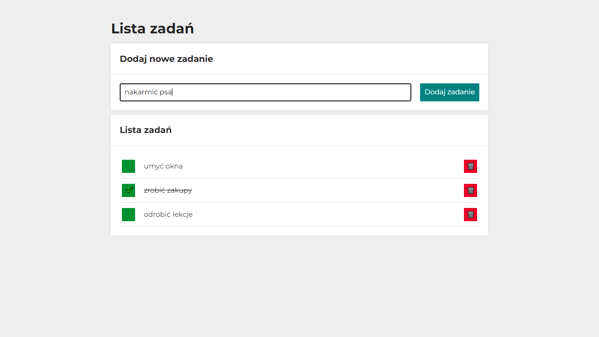

# Tasks List

## DEMO:
[click to visit](https://radekw86.github.io/task-list/)

This app allows user to create an ad-hoc task list, mark tasks done/undone and remove tasks from the list. The operation is performed via functional buttons and a form.
The js script behind uses a table of objects processed in accordance with immutability and simple arrow functions to provide the functionality.
The latest version is in Polish.

html, CSS & BEM, JS ES6+

